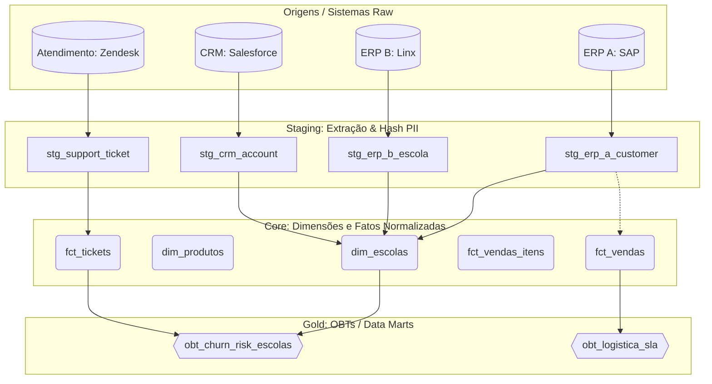

# Arquitetura Medallion: Fluxo de Dados (Arco Educação)

Este documento descreve a topologia arquitetural implementada no Data Warehouse utilizando dbt e DuckDB.

## 1. Topologia (DAG Macro)

## 2. Padrões de Design
1. **Hash de PII em Staging:** Nenhuma tabela de Core ou Gold recebe dados sensíveis puros (CNPJ, Email, Telefone). Tudo é convertido via `hash_pii` na camada Staging.
2. **Separação Header/Detail:** Pedidos (Header) e Itens (Detail) são mantidos estritamente separados em fatos distintas (`fct_vendas` e `fct_vendas_itens`) para evitar métricas falsas (Fan-out) em funções de agregação SUM().
3. **UNION ALL para Integração:** Entidades comuns (como Escolas ou Vendas) advindas de diferentes ERPs são normalizadas e aglutinadas utilizando sintaxe `UNION ALL` adicionando prefixos rígidos aos IDs (ex: `ERP_A_123`).
