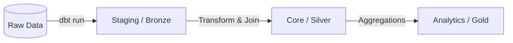

# Arquitetura do Data Warehouse (DBT Medallion Architecture)

Este documento descreve a governança de engenharia e modelagem dimensional aplicada através do DBT na Arco Analytics. A infraestrutura de dados opera estruturada na **Arquitetura Medalhão**, dividida analiticamente em três camadas operacionais distintas (Bronze, Silver e Gold).

---

## 1. Visão Geral da Arquitetura

A arquitetura do DWH no BigQuery divide o processamento garantindo os seguintes princípios técnicos:
1. **Rastreabilidade e Linhagem:** Tabelas de negócios sempre descendem das fontes originais declaradas.
2. **Resolução de Entidades Cross-System:** Como os 5 ecossistemas operacionais não compartilham de um Master Data Management (MDM), chaves de integração baseadas em **CNPJ**, **Order Ref** e **Contract Number** são usadas na camada Silver para conectar a jornada analítica da escola.

---

## 2. Camada Bronze (Staging)

A camada Staging representa as tabelas originais espelhadas (`1:1`) diretamente do Raw Layer para dentro do processamento DBT. Todas as tabelas têm o prefixo `stg_`.

### Responsabilidades da Camada:
- **Tipagem Estrita (Type Casting):** Adequação dos formatos nativos (ex: `VARCHAR` convertidos explicitamente para `STRING`, `BIGINT`, `DATE` via `CAST()`).
- **Anonimização de PII (Lei Geral de Proteção de Dados - LGPD):** Campos identificáveis pessoais como E-mail, Telefones sensíveis e certos CNPJs sofrem hashing imediato ao entrarem no Data Warehouse (usando macros como `hash_pii` e `clean_cnpj`).
- **Nomenclatura (Snake Case):** Conversão dos padrões de nomes oriundos dos ERPs (ex: `DocEntry`, `NumAtCard`) para `snake_case` global (ex: `doc_entry`, `num_at_card`).

> [!WARNING]
> A camada Staging não realiza deduplicação avançada de dados ou JOINs entre as origens. Ela reflete apenas os dados brutos com a devida limpeza de formatação.

---

## 3. Camada Silver (Core)

A camada Core (ou Silver) é o centro de negócios da companhia e baseia-se em conceitos de modelagem de dados dimensional (**Star Schema** ou **Snowflake Schema**), contendo Fatos e Dimensões unificadas. 

### Principais Entidades e Estruturas:
- **Dimensões (`dim_`):** Entidades descritivas que carregam os atributos qualitativos do negócio (ex: Escolas, Contratos, Produtos, Vendedores, Usuários). Tabelas consolidadas com deduplicação avançada.
- **Fatos (`fct_`):** Tabelas que documentam métricas numéricas e grandes eventos da empresa no tempo (ex: Vendas, Vendas Itens, Logística, Atendimento ao Cliente).

### Resolução Transacional (Soft Links):
Uma vez que `erp_a` e `erp_b` nunca dividem a mesma chave natural (ID), a camada Silver une transações globalmente por meio de Pistas:
- Vendas ligadas pelo `CNPJ` da Escola (`dim_escolas`).
- Fatos logísticos ligados a pedidos usando o número do contrato unificado.
- Atendimentos da Zendesk (`fct_tickets`) cruzados com faturamento via campos customizados do Zendesk (`custom_field_order_ref`).

### Performance e Tuning:
- Uso agressivo de chaves primárias e substitutas criadas nativamente (`dbt_utils.generate_surrogate_key`).
- **Clustering:** Filtros de baixa cardinalidade (ex: `status`, `sistema_origem`) e janelas de particionamento (ex: `created_at`) são aplicados estrategicamente em tabelas granulares.

---

## 4. Camada Gold (Analytics)

A camada de Analytics (Gold) engloba Tabelas Grandes e Desnormalizadas, frequentemente conhecidas como **OBT (One Big Table)**, ou Tabelas de Agregação e Dashboards de Fim de Funil.

### Foco e Propósito:
- Projetadas para máxima velocidade e clareza analítica em ferramentas de visualização (BI - Metabase, Looker, PowerBI).
- Eliminação da necessidade do analista realizar JOINs. Tabelas da camada `Gold` já reúnem as dimensões essenciais pre-agregadas com a tabela de fatos em questão.
- Tabelas de KPIs isolados (Ex: `obt_logistica_sla`, `obt_churn_risk_escolas`).

### Boas Práticas Adotadas:
- Prefixo `obt_` utilizado extensivamente para sinalizar modelos orientados a visualização.
- Seleção pontual de colunas (`SELECT col1, col2, col3`), com proibição total de `SELECT *` após CTEs base de cálculo, para mitigar desperdício computacional em queries colunares (BigQuery).
