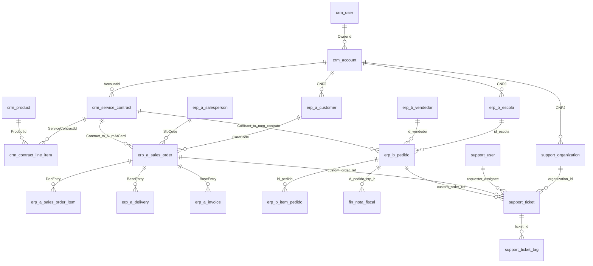

# Documentação Executiva - Camada RAW (Raw Data)

Esta documentação provê uma visão arquitetural e de negócio sobre os dados crus (RAW) consumidos pela Arco Analytics. O ecossistema consolida 5 sistemas diferentes responsáveis por orquestrar todo o ciclo de vida do cliente (escolas).

## 1. Diagrama Entidade-Relacionamento (ERD)

O diagrama abaixo mapeia as relações intra-sistemas e cross-sistemas (chaves lógicas de negócio) no estado em que os dados são extraídos para o Data Warehouse.

---

## 2. Dicionário de Dados Executivo (RAW)

### 2.1. CRM (Customer Relationship Management)
Sistema utilizado pela equipe comercial para controlar prospecção, cadastro de escolas, contratos e catálogo de produtos.

| Tabela RAW | O que representa para o Negócio | Identificador Principal (PK) | Chaves Estrangeiras (FK) |
| :--- | :--- | :--- | :--- |
| **crm_account** | Cadastro único das escolas no momento da prospecção. | `Id` | `OwnerId` |
| **crm_user** | Usuários internos (representantes de vendas/comercial). | `Id` | - |
| **crm_service_contract** | Contratos de fornecimento fechados com as escolas. | `Id` | `AccountId`, `OwnerId` |
| **crm_contract_line_item** | Itens (produtos) que compõem o contrato fechado. | `Id` | `ServiceContractId`, `ProductId` |
| **crm_product** | Catálogo corporativo de materiais e soluções. | `Id` | - |

### 2.2. ERP A (Sistema Operacional Principal)
Gerencia o fluxo completo de logística e faturamento da marca principal.

| Tabela RAW | O que representa para o Negócio | Identificador Principal (PK) | Chaves Estrangeiras (FK) |
| :--- | :--- | :--- | :--- |
| **erp_a_customer** | Cadastro espelho da escola dentro do ERP (para faturamento). | `CardCode` | - |
| **erp_a_sales_order** | Cabeçalho do pedido logístico gerado para a escola. | `DocEntry` | `CardCode`, `SlpCode` |
| **erp_a_sales_order_item** | Linhas do pedido com quantidades e itens físicos. | `DocEntry`, `LineNum` | `DocEntry` |
| **erp_a_delivery** | Ordem de entrega associada ao pedido gerado. | `DocEntry` | `BaseEntry` (Pedido) |
| **erp_a_invoice** | Nota fiscal associada ao pedido/entrega para controle contábil. | `DocEntry` | `BaseEntry` (Pedido) |
| **erp_a_salesperson** | Vendedor ou responsável associado ao pedido. | `SlpCode` | - |

### 2.3. ERP B (Marca Legado)
Sistema reduzido usado apenas para marcas legado (sem logística/faturamento integrados).

| Tabela RAW | O que representa para o Negócio | Identificador Principal (PK) | Chaves Estrangeiras (FK) |
| :--- | :--- | :--- | :--- |
| **erp_b_escola** | Cadastro da escola no ERP legado. | `id_escola` | - |
| **erp_b_vendedor** | Cadastro de vendedores que atendem a marca legado. | `id_vendedor` | - |
| **erp_b_pedido** | Cabeçalho dos pedidos comerciais do ERP legado. | `id_pedido` | `id_escola`, `id_vendedor` |
| **erp_b_item_pedido** | Itens que fazem parte do pedido legado. | `id_item` | `id_pedido` |

### 2.4. Sistema Financeiro (Satelite do ERP B)
Como o ERP B não lida com entregas nem emissão fiscal, um sistema externo gerencia esse fim de funil.

| Tabela RAW | O que representa para o Negócio | Identificador Principal (PK) | Chaves Estrangeiras (FK) |
| :--- | :--- | :--- | :--- |
| **fin_nota_fiscal** | Controle fiscal e logístico terceirizado dos pedidos da marca legado. | `id_nota` | `id_pedido_erp_b` |

### 2.5. Sistema de Atendimento (Zendesk/Pós-venda)
Controla os tickets de suporte e acompanhamento de relacionamento das escolas.

| Tabela RAW | O que representa para o Negócio | Identificador Principal (PK) | Chaves Estrangeiras (FK) |
| :--- | :--- | :--- | :--- |
| **support_organization** | Cadastro espelho das escolas na ferramenta de suporte. | `id` | - |
| **support_user** | Analistas de atendimento e usuários solicitantes do chamado. | `id` | `organization_id` |
| **support_ticket** | Chamados e incidentes (atrasos, dúvidas) abertos pelas escolas. | `id` | `organization_id`, `requester_id`, `assignee_id` |
| **support_ticket_tag** | Categorizações ou métricas associadas aos chamados (ex: atraso, quebra). | `ticket_id`, `tag` | `ticket_id` |

---

## 3. Dinâmica das Chaves de Integração (Cross-system Pistas)
Como não há um Master Data Management (MDM) centralizando `IDs` entre todos os sistemas, o modelo baseia-se em **chaves analíticas lógicas** (Soft Links) consolidadas via DBT:
1. **Pessoa Jurídica:** As escolas são conectadas em diferentes sistemas primordialmente através de normalização de `CNPJ`. (ex: CRM <-> ERP A).
2. **Número de Contrato:** Um contrato no CRM (`ContractNumber`) pode ser ligado a um ou vários pedidos no ERP A (campo `NumAtCard`) e no ERP B (campo `num_contrato`).
3. **Tracking Logístico:** Tickets abertos por insatisfação com entregas ou dúvidas de pedido são mapeados utilizando o número do pedido via `custom_field_order_ref` gravado na tabela do Zendesk/Suporte.

## 4. Schemas e Campos das Tabelas RAW

Abaixo detalhamos a estrutura de cada uma das tabelas, seus campos extraídos e as descrições (metadados) importadas diretamente dos mapeamentos do Data Warehouse.

### 4.1. CRM (Customer Relationship Management)

#### Tabela: `crm_account`

Estrutura raw da tabela crm_account. Contém limpeza de campos, normalização de CNPJ/Telefone e hash de dados PII para conformidade com a LGPD. Fonte de verdade inicial do DW.

| Campo | Descrição |
| :--- | :--- |
| `id` | Chave primária (Primary Key) que identifica univocamente o registro na tabela crm_account. |
| `name` | Nome ou Razão Social associado ao registro. |
| `razaosocial__c` | Nome ou Razão Social associado ao registro. |
| `cnpj__c` | Cadastro Nacional da Pessoa Jurídica (CNPJ). Chave de negócio tratada e limpa (apenas números). |
| `type` | Campo type importado da origem crm_account. |
| `parentid` | Campo parentid importado da origem crm_account. |
| `phone` | Telefone de contato normalizado (apenas números, sem código de país +55). |
| `billingcity` | Campo billingcity importado da origem crm_account. |
| `billingstate` | Campo billingstate importado da origem crm_account. |
| `salesmodality__c` | Campo salesmodality__c importado da origem crm_account. |
| `segment__c` | Campo segment__c importado da origem crm_account. |
| `ownerid` | Campo ownerid importado da origem crm_account. |
| `isdeleted` | Campo isdeleted importado da origem crm_account. |
| `createddate` | Data/Carimbo de tempo (Timestamp) referenciando a criação ou atualização do evento. |
| `lastmodifieddate` | Data/Carimbo de tempo (Timestamp) referenciando a criação ou atualização do evento. |

#### Tabela: `crm_contract_line_item`

Estrutura raw da tabela crm_contract_line_item. Contém limpeza de campos, normalização de CNPJ/Telefone e hash de dados PII para conformidade com a LGPD. Fonte de verdade inicial do DW.

| Campo | Descrição |
| :--- | :--- |
| `id` | Chave primária (Primary Key) que identifica univocamente o registro na tabela crm_contract_line_item. |
| `servicecontractid` | Campo servicecontractid importado da origem crm_contract_line_item. |
| `productid` | Campo productid importado da origem crm_contract_line_item. |
| `materialtype__c` | Campo materialtype__c importado da origem crm_contract_line_item. |
| `schoolgrade__c` | Campo schoolgrade__c importado da origem crm_contract_line_item. |
| `segment__c` | Campo segment__c importado da origem crm_contract_line_item. |
| `quantity` | Campo quantity importado da origem crm_contract_line_item. |
| `unitprice` | Campo unitprice importado da origem crm_contract_line_item. |
| `discount` | Campo discount importado da origem crm_contract_line_item. |
| `totalprice` | Campo totalprice importado da origem crm_contract_line_item. |
| `createddate` | Data/Carimbo de tempo (Timestamp) referenciando a criação ou atualização do evento. |

#### Tabela: `crm_product`

Estrutura raw da tabela crm_product. Contém limpeza de campos, normalização de CNPJ/Telefone e hash de dados PII para conformidade com a LGPD. Fonte de verdade inicial do DW.

| Campo | Descrição |
| :--- | :--- |
| `id` | Chave primária (Primary Key) que identifica univocamente o registro na tabela crm_product. |
| `productcode` | Campo productcode importado da origem crm_product. |
| `name` | Nome ou Razão Social associado ao registro. |
| `brand__c` | Campo brand__c importado da origem crm_product. |
| `materialtype__c` | Campo materialtype__c importado da origem crm_product. |
| `isactive` | Campo isactive importado da origem crm_product. |
| `createddate` | Data/Carimbo de tempo (Timestamp) referenciando a criação ou atualização do evento. |

#### Tabela: `crm_service_contract`

Estrutura raw da tabela crm_service_contract. Contém limpeza de campos, normalização de CNPJ/Telefone e hash de dados PII para conformidade com a LGPD. Fonte de verdade inicial do DW.

| Campo | Descrição |
| :--- | :--- |
| `id` | Chave primária (Primary Key) que identifica univocamente o registro na tabela crm_service_contract. |
| `contractnumber` | Campo contractnumber importado da origem crm_service_contract. |
| `name` | Nome ou Razão Social associado ao registro. |
| `accountid` | Campo accountid importado da origem crm_service_contract. |
| `ownerid` | Campo ownerid importado da origem crm_service_contract. |
| `status` | Status do registro, sujeito a normalização na camada Silver. |
| `startdate` | Data/Carimbo de tempo (Timestamp) referenciando a criação ou atualização do evento. |
| `enddate` | Data/Carimbo de tempo (Timestamp) referenciando a criação ou atualização do evento. |
| `brand__c` | Campo brand__c importado da origem crm_service_contract. |
| `grandtotal` | Campo grandtotal importado da origem crm_service_contract. |
| `totalprice` | Campo totalprice importado da origem crm_service_contract. |
| `discount` | Campo discount importado da origem crm_service_contract. |
| `marketingmodel__c` | Campo marketingmodel__c importado da origem crm_service_contract. |
| `isdeleted` | Campo isdeleted importado da origem crm_service_contract. |
| `createddate` | Data/Carimbo de tempo (Timestamp) referenciando a criação ou atualização do evento. |
| `lastmodifieddate` | Data/Carimbo de tempo (Timestamp) referenciando a criação ou atualização do evento. |

#### Tabela: `crm_user`

Estrutura raw da tabela crm_user. Contém limpeza de campos, normalização de CNPJ/Telefone e hash de dados PII para conformidade com a LGPD. Fonte de verdade inicial do DW.

| Campo | Descrição |
| :--- | :--- |
| `id` | Chave primária (Primary Key) que identifica univocamente o registro na tabela crm_user. |
| `name` | Nome ou Razão Social associado ao registro. |
| `email` | Endereço de e-mail corporativo ou de contato. Hash aplicado para conformidade com LGPD. |
| `profilename` | Nome ou Razão Social associado ao registro. |
| `isactive` | Campo isactive importado da origem crm_user. |
| `createddate` | Data/Carimbo de tempo (Timestamp) referenciando a criação ou atualização do evento. |
| `lastmodifieddate` | Data/Carimbo de tempo (Timestamp) referenciando a criação ou atualização do evento. |

### 4.2. ERP A (Sistema Operacional Principal)

#### Tabela: `erp_a_customer`

Estrutura raw da tabela erp_a_customer. Contém limpeza de campos, normalização de CNPJ/Telefone e hash de dados PII para conformidade com a LGPD. Fonte de verdade inicial do DW.

| Campo | Descrição |
| :--- | :--- |
| `cardcode` | Chave primária (Primary Key) que identifica univocamente o registro na tabela erp_a_customer. |
| `cardname` | Nome ou Razão Social associado ao registro. |
| `cnpj` | Cadastro Nacional da Pessoa Jurídica (CNPJ). Chave de negócio tratada e limpa (apenas números). |
| `city` | Campo city importado da origem erp_a_customer. |
| `state` | Campo state importado da origem erp_a_customer. |
| `phone1` | Telefone de contato normalizado (apenas números, sem código de país +55). |
| `e_mail` | Campo e_mail importado da origem erp_a_customer. |
| `slpcode` | Chave primária (Primary Key) que identifica univocamente o registro na tabela erp_a_customer. |
| `createdate` | Data/Carimbo de tempo (Timestamp) referenciando a criação ou atualização do evento. |
| `updatedate` | Data/Carimbo de tempo (Timestamp) referenciando a criação ou atualização do evento. |

#### Tabela: `erp_a_delivery`

Estrutura raw da tabela erp_a_delivery. Contém limpeza de campos, normalização de CNPJ/Telefone e hash de dados PII para conformidade com a LGPD. Fonte de verdade inicial do DW.

| Campo | Descrição |
| :--- | :--- |
| `docentry` | Chave primária (Primary Key) que identifica univocamente o registro na tabela erp_a_delivery. |
| `docnum` | Campo docnum importado da origem erp_a_delivery. |
| `cardcode` | Chave primária (Primary Key) que identifica univocamente o registro na tabela erp_a_delivery. |
| `baseentry` | Campo baseentry importado da origem erp_a_delivery. |
| `docdate` | Data/Carimbo de tempo (Timestamp) referenciando a criação ou atualização do evento. |
| `docstatus` | Status do registro, sujeito a normalização na camada Silver. |
| `cancelled` | Campo cancelled importado da origem erp_a_delivery. |
| `createdate` | Data/Carimbo de tempo (Timestamp) referenciando a criação ou atualização do evento. |

#### Tabela: `erp_a_invoice`

Estrutura raw da tabela erp_a_invoice. Contém limpeza de campos, normalização de CNPJ/Telefone e hash de dados PII para conformidade com a LGPD. Fonte de verdade inicial do DW.

| Campo | Descrição |
| :--- | :--- |
| `docentry` | Chave primária (Primary Key) que identifica univocamente o registro na tabela erp_a_invoice. |
| `docnum` | Campo docnum importado da origem erp_a_invoice. |
| `cardcode` | Chave primária (Primary Key) que identifica univocamente o registro na tabela erp_a_invoice. |
| `baseentry` | Campo baseentry importado da origem erp_a_invoice. |
| `docdate` | Data/Carimbo de tempo (Timestamp) referenciando a criação ou atualização do evento. |
| `doctotal` | Campo doctotal importado da origem erp_a_invoice. |
| `vatsum` | Campo vatsum importado da origem erp_a_invoice. |
| `cancelled` | Campo cancelled importado da origem erp_a_invoice. |
| `createdate` | Data/Carimbo de tempo (Timestamp) referenciando a criação ou atualização do evento. |

#### Tabela: `erp_a_sales_order`

Estrutura raw da tabela erp_a_sales_order. Contém limpeza de campos, normalização de CNPJ/Telefone e hash de dados PII para conformidade com a LGPD. Fonte de verdade inicial do DW.

| Campo | Descrição |
| :--- | :--- |
| `docentry` | Chave primária (Primary Key) que identifica univocamente o registro na tabela erp_a_sales_order. |
| `docnum` | Campo docnum importado da origem erp_a_sales_order. |
| `cardcode` | Chave primária (Primary Key) que identifica univocamente o registro na tabela erp_a_sales_order. |
| `numatcard` | Campo numatcard importado da origem erp_a_sales_order. |
| `docdate` | Data/Carimbo de tempo (Timestamp) referenciando a criação ou atualização do evento. |
| `docduedate` | Data/Carimbo de tempo (Timestamp) referenciando a criação ou atualização do evento. |
| `docstatus` | Status do registro, sujeito a normalização na camada Silver. |
| `cancelled` | Campo cancelled importado da origem erp_a_sales_order. |
| `comments` | Campo comments importado da origem erp_a_sales_order. |
| `slpcode` | Chave primária (Primary Key) que identifica univocamente o registro na tabela erp_a_sales_order. |
| `createdate` | Data/Carimbo de tempo (Timestamp) referenciando a criação ou atualização do evento. |
| `updatedate` | Data/Carimbo de tempo (Timestamp) referenciando a criação ou atualização do evento. |

#### Tabela: `erp_a_sales_order_item`

Estrutura raw da tabela erp_a_sales_order_item. Contém limpeza de campos, normalização de CNPJ/Telefone e hash de dados PII para conformidade com a LGPD. Fonte de verdade inicial do DW.

| Campo | Descrição |
| :--- | :--- |
| `docentry` | Chave estrangeira para o cabeçalho do pedido (sales order). |
| `linenum` | Campo linenum importado da origem erp_a_sales_order_item. |
| `itemcode` | Campo itemcode importado da origem erp_a_sales_order_item. |
| `itemname` | Nome ou Razão Social associado ao registro. |
| `quantity` | Campo quantity importado da origem erp_a_sales_order_item. |
| `delivrdqty` | Campo delivrdqty importado da origem erp_a_sales_order_item. |
| `openqty` | Campo openqty importado da origem erp_a_sales_order_item. |
| `shipdate` | Data/Carimbo de tempo (Timestamp) referenciando a criação ou atualização do evento. |
| `linestatus` | Status do registro, sujeito a normalização na camada Silver. |
| `price` | Campo price importado da origem erp_a_sales_order_item. |
| `linetotal` | Campo linetotal importado da origem erp_a_sales_order_item. |

#### Tabela: `erp_a_salesperson`

Estrutura raw da tabela erp_a_salesperson. Contém limpeza de campos, normalização de CNPJ/Telefone e hash de dados PII para conformidade com a LGPD. Fonte de verdade inicial do DW.

| Campo | Descrição |
| :--- | :--- |
| `slpcode` | Chave primária (Primary Key) que identifica univocamente o registro na tabela erp_a_salesperson. |
| `slpname` | Nome ou Razão Social associado ao registro. |
| `memo` | Campo memo importado da origem erp_a_salesperson. |
| `active` | Campo active importado da origem erp_a_salesperson. |

### 4.3. ERP B (Marca Legado)

#### Tabela: `erp_b_escola`

Estrutura raw da tabela erp_b_escola. Contém limpeza de campos, normalização de CNPJ/Telefone e hash de dados PII para conformidade com a LGPD. Fonte de verdade inicial do DW.

| Campo | Descrição |
| :--- | :--- |
| `id_escola` | Chave primária (Primary Key) que identifica univocamente o registro na tabela erp_b_escola. |
| `nome_escola` | Nome ou Razão Social associado ao registro. |
| `cnpj` | Cadastro Nacional da Pessoa Jurídica (CNPJ). Chave de negócio tratada e limpa (apenas números). |
| `cidade` | Campo cidade importado da origem erp_b_escola. |
| `estado` | Campo estado importado da origem erp_b_escola. |
| `email` | Endereço de e-mail corporativo ou de contato. Hash aplicado para conformidade com LGPD. |
| `id_vendedor` | Chave primária (Primary Key) que identifica univocamente o registro na tabela erp_b_escola. |
| `dt_cadastro` | Data/Carimbo de tempo (Timestamp) referenciando a criação ou atualização do evento. |
| `dt_atualizacao` | Data/Carimbo de tempo (Timestamp) referenciando a criação ou atualização do evento. |

#### Tabela: `erp_b_item_pedido`

Estrutura raw da tabela erp_b_item_pedido. Contém limpeza de campos, normalização de CNPJ/Telefone e hash de dados PII para conformidade com a LGPD. Fonte de verdade inicial do DW.

| Campo | Descrição |
| :--- | :--- |
| `id_item` | Campo id_item importado da origem erp_b_item_pedido. |
| `id_pedido` | Chave primária (Primary Key) que identifica univocamente o registro na tabela erp_b_item_pedido. |
| `cod_produto` | Campo cod_produto importado da origem erp_b_item_pedido. |
| `desc_produto` | Campo desc_produto importado da origem erp_b_item_pedido. |
| `qtd_pedida` | Campo qtd_pedida importado da origem erp_b_item_pedido. |
| `preco_unitario` | Campo preco_unitario importado da origem erp_b_item_pedido. |
| `dt_criacao` | Data/Carimbo de tempo (Timestamp) referenciando a criação ou atualização do evento. |

#### Tabela: `erp_b_pedido`

Estrutura raw da tabela erp_b_pedido. Contém limpeza de campos, normalização de CNPJ/Telefone e hash de dados PII para conformidade com a LGPD. Fonte de verdade inicial do DW.

| Campo | Descrição |
| :--- | :--- |
| `id_pedido` | Chave primária (Primary Key) que identifica univocamente o registro na tabela erp_b_pedido. |
| `id_escola` | Chave primária (Primary Key) que identifica univocamente o registro na tabela erp_b_pedido. |
| `num_contrato` | Campo num_contrato importado da origem erp_b_pedido. |
| `dt_pedido` | Data/Carimbo de tempo (Timestamp) referenciando a criação ou atualização do evento. |
| `dt_entrega_prevista` | Data/Carimbo de tempo (Timestamp) referenciando a criação ou atualização do evento. |
| `status` | Status do registro, sujeito a normalização na camada Silver. |
| `id_vendedor` | Chave primária (Primary Key) que identifica univocamente o registro na tabela erp_b_pedido. |
| `dt_criacao` | Data/Carimbo de tempo (Timestamp) referenciando a criação ou atualização do evento. |
| `dt_atualizacao` | Data/Carimbo de tempo (Timestamp) referenciando a criação ou atualização do evento. |

#### Tabela: `erp_b_vendedor`

Estrutura raw da tabela erp_b_vendedor. Contém limpeza de campos, normalização de CNPJ/Telefone e hash de dados PII para conformidade com a LGPD. Fonte de verdade inicial do DW.

| Campo | Descrição |
| :--- | :--- |
| `id_vendedor` | Chave primária (Primary Key) que identifica univocamente o registro na tabela erp_b_vendedor. |
| `nome` | Nome ou Razão Social associado ao registro. |
| `email` | Endereço de e-mail corporativo ou de contato. Hash aplicado para conformidade com LGPD. |
| `regiao` | Campo regiao importado da origem erp_b_vendedor. |
| `ativo` | Campo ativo importado da origem erp_b_vendedor. |

### 4.4. Sistema Financeiro (Satelite do ERP B)

#### Tabela: `fin_nota_fiscal`

Estrutura raw da tabela fin_nota_fiscal. Contém limpeza de campos, normalização de CNPJ/Telefone e hash de dados PII para conformidade com a LGPD. Fonte de verdade inicial do DW.

| Campo | Descrição |
| :--- | :--- |
| `id_nf` | Chave primária (Primary Key) que identifica univocamente o registro na tabela fin_nota_fiscal. |
| `numero_nf` | Campo numero_nf importado da origem fin_nota_fiscal. |
| `serie_nf` | Campo serie_nf importado da origem fin_nota_fiscal. |
| `id_pedido_erp_b` | Campo id_pedido_erp_b importado da origem fin_nota_fiscal. |
| `cnpj_cliente` | Cadastro Nacional da Pessoa Jurídica (CNPJ). Chave de negócio tratada e limpa (apenas números). |
| `nome_cliente` | Nome ou Razão Social associado ao registro. |
| `dt_emissao` | Data/Carimbo de tempo (Timestamp) referenciando a criação ou atualização do evento. |
| `valor_total` | Campo valor_total importado da origem fin_nota_fiscal. |
| `valor_impostos` | Campo valor_impostos importado da origem fin_nota_fiscal. |
| `cnpj_transportadora` | Cadastro Nacional da Pessoa Jurídica (CNPJ). Chave de negócio tratada e limpa (apenas números). |
| `nome_transportadora` | Nome ou Razão Social associado ao registro. |
| `codigo_rastreio` | Campo codigo_rastreio importado da origem fin_nota_fiscal. |
| `dt_prevista_entrega` | Data/Carimbo de tempo (Timestamp) referenciando a criação ou atualização do evento. |
| `dt_entrega_real` | Data/Carimbo de tempo (Timestamp) referenciando a criação ou atualização do evento. |
| `status_entrega` | Status do registro, sujeito a normalização na camada Silver. |
| `qtd_entregue` | Campo qtd_entregue importado da origem fin_nota_fiscal. |
| `dt_criacao` | Data/Carimbo de tempo (Timestamp) referenciando a criação ou atualização do evento. |

### 4.5. Sistema de Atendimento (Zendesk)

#### Tabela: `support_organization`

Estrutura raw da tabela support_organization. Contém limpeza de campos, normalização de CNPJ/Telefone e hash de dados PII para conformidade com a LGPD. Fonte de verdade inicial do DW.

| Campo | Descrição |
| :--- | :--- |
| `id` | Chave primária (Primary Key) que identifica univocamente o registro na tabela support_organization. |
| `name` | Nome ou Razão Social associado ao registro. |
| `details` | Campo details importado da origem support_organization. |
| `external_id` | Campo external_id importado da origem support_organization. |
| `domain_names` | Nome ou Razão Social associado ao registro. |
| `created_at` | Data/Carimbo de tempo (Timestamp) referenciando a criação ou atualização do evento. |
| `updated_at` | Data/Carimbo de tempo (Timestamp) referenciando a criação ou atualização do evento. |

#### Tabela: `support_ticket`

Estrutura raw da tabela support_ticket. Contém limpeza de campos, normalização de CNPJ/Telefone e hash de dados PII para conformidade com a LGPD. Fonte de verdade inicial do DW.

| Campo | Descrição |
| :--- | :--- |
| `id` | Chave primária (Primary Key) que identifica univocamente o registro na tabela support_ticket. |
| `subject` | Campo subject importado da origem support_ticket. |
| `description` | Campo description importado da origem support_ticket. |
| `status` | Status do registro, sujeito a normalização na camada Silver. |
| `priority` | Campo priority importado da origem support_ticket. |
| `type` | Campo type importado da origem support_ticket. |
| `requester_id` | Campo requester_id importado da origem support_ticket. |
| `submitter_id` | Campo submitter_id importado da origem support_ticket. |
| `assignee_id` | Campo assignee_id importado da origem support_ticket. |
| `organization_id` | Campo organization_id importado da origem support_ticket. |
| `tags` | Campo tags importado da origem support_ticket. |
| `custom_field_order_ref` | Campo custom_field_order_ref importado da origem support_ticket. |
| `custom_field_cnpj` | Cadastro Nacional da Pessoa Jurídica (CNPJ). Chave de negócio tratada e limpa (apenas números). |
| `satisfaction_score` | Campo satisfaction_score importado da origem support_ticket. |
| `satisfaction_comment` | Campo satisfaction_comment importado da origem support_ticket. |
| `created_at` | Data/Carimbo de tempo (Timestamp) referenciando a criação ou atualização do evento. |
| `updated_at` | Data/Carimbo de tempo (Timestamp) referenciando a criação ou atualização do evento. |
| `solved_at` | Data/Carimbo de tempo (Timestamp) referenciando a criação ou atualização do evento. |
| `due_at` | Data/Carimbo de tempo (Timestamp) referenciando a criação ou atualização do evento. |

#### Tabela: `support_ticket_tag`

Estrutura raw da tabela support_ticket_tag. Contém limpeza de campos, normalização de CNPJ/Telefone e hash de dados PII para conformidade com a LGPD. Fonte de verdade inicial do DW.

| Campo | Descrição |
| :--- | :--- |
| `ticket_id` | Campo ticket_id importado da origem support_ticket_tag. |
| `tag` | Campo tag importado da origem support_ticket_tag. |

#### Tabela: `support_user`

Estrutura raw da tabela support_user. Contém limpeza de campos, normalização de CNPJ/Telefone e hash de dados PII para conformidade com a LGPD. Fonte de verdade inicial do DW.

| Campo | Descrição |
| :--- | :--- |
| `id` | Chave primária (Primary Key) que identifica univocamente o registro na tabela support_user. |
| `name` | Nome ou Razão Social associado ao registro. |
| `email` | Endereço de e-mail corporativo ou de contato. Hash aplicado para conformidade com LGPD. |
| `phone` | Telefone de contato normalizado (apenas números, sem código de país +55). |
| `organization_id` | Campo organization_id importado da origem support_user. |
| `role` | Campo role importado da origem support_user. |
| `is_active` | Campo is_active importado da origem support_user. |
| `created_at` | Data/Carimbo de tempo (Timestamp) referenciando a criação ou atualização do evento. |
| `updated_at` | Data/Carimbo de tempo (Timestamp) referenciando a criação ou atualização do evento. |

